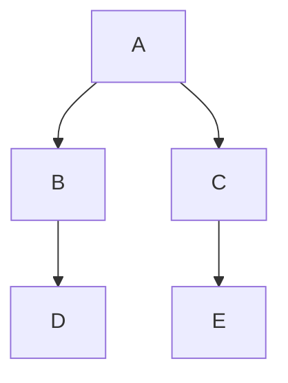

# CheetSheet
## MarkDown
### 折りたたみ
<details>
<summary>折りたたみの書き方</summary>

```Markdown
<details>  
<summary>折りたたみの書き方</summary>  
こんな感じ  
</details>  
```

</details>

---
### 数式
+ $$ で囲むことを忘れない。
```math
$$ 
\frac{C(n)}{n} = \frac{\sum_{i=1}^{n}c_i}{n}  
$$  
```
$$
\frac{C(n)}{n} = \frac{\sum_{i=1}^{n}c_i}{n}
$$
+ その他の例
$$ x^{2+a} $$
$$ 100 \times x = y $$
$$ e^{\pi i}= -1 $$

$$ x^2 $$

</br>
\begin{align}
f(x) &= x^2+3x+2\\\ 
&= (x+1)(x+2)
\end{align}

$$ a \Biggl(b \biggl(c \Bigl(d \bigl(e ( f + g )\bigr)\Bigr)\biggr)\Biggr) $$

+ [参考:https://qiita.com/PlanetMeron/items/63ac58898541cbe81ada](https://qiita.com/PlanetMeron/items/63ac58898541cbe81ada)

---
### 色の付け方
+ <font color="red">こんな感じ</font>  
`<font color="red">ここに文章</font>`

<details>
<summary>色の例</summary>  

- **ピンク系**
  - <font color="Pink">Pink</font>
   <font color="LightPink">LightPink</font>
   <font color="HotPink">HotPink</font> 
   <font color="DeepPink">DeepPink</font>
   <font color="PaleVioletRed">PaleVioletRed</font>
   <font color="MediumVioletRed">MediumVioletRed</font>
---
- **パープル系**
  - <font color="Lavender">Lavender</font>
   <font color="Thistle">Thistle</font>
   <font color="Plum">Plum</font>
   <font color="Orchid">Orchid</font>
   <font color="Violet">Violet</font>
   <font color="Fuchsia">Fuchsia</font>
   <font color="Magenta">Magenta</font>
   <font color="MediumOrchid">MediumOrchid</font>
   <font color="DarkOrchid">DarkOrchid</font>
   <font color="DarkViolet">DarkViolet</font>
   <font color="BlueViolet">BlueViolet</font>
   <font color="DarkMagenta">DarkMagenta</font>
   <font color="Purple">Purple</font>
   <font color="MediumPurple">MediumPurple</font>
   <font color="MediumSlateBlue">MediumSlateBlue</font>
   <font color="SlateBlue">SlateBlue</font>
   <font color="DarkSlateBlue">DarkSlateBlue</font>
   <font color="RebeccaPurple">RebeccaPurple</font>
   <font color="Indigo">Indigo</font>

---
- **赤系**
  - <font color="LightSalmon">LightSalmon</font>
   <font color="Salmon">Salmon</font>
   <font color="DarkSalmon">DarkSalmon</font>
   <font color="LightCoral">LightCoral</font>
   <font color="IndianRed">IndianRed</font>
   <font color="Crimson">Crimson</font>
   <font color="Red">Red</font>
   <font color="FireBrick">FireBrick</font>
   <font color="DarkRed">DarkRed</font>

---
- **オレンジ系**
  - <font color="Orange">Orange</font>
   <font color="DarkOrange">DarkOrange</font>
   <font color="Coral">Coral</font>
   <font color="Tomato">Tomato</font>
   <font color="OrangeRed">OrangeRed</font>

---
- **黄色系**
  - <font color="Gold">Gold</font>
   <font color="Yellow">Yellow</font>
   <font color="LightYellow">LightYellow</font>
   <font color="LemonChiffon">LemonChiffon</font>
   <font color="LightGoldenRodYellow">LightGoldenRodYellow</font>
   <font color="PapayaWhip">PapayaWhip</font>
   <font color="Moccasin">Moccasin</font>
   <font color="PeachPuff">PeachPuff</font>
   <font color="PaleGoldenRod">PaleGoldenRod</font>
   <font color="Khaki">Khaki</font>
   <font color="DarkKhaki">DarkKhaki</font>

---
- **緑系**
  - <font color="GreenYellow">GreenYellow</font>
   <font color="Chartreuse">Chartreuse</font>
   <font color="LawnGreen">LawnGreen</font>
   <font color="Lime">Lime</font>
   <font color="LimeGreen">LimeGreen</font>
   <font color="PaleGreen">PaleGreen</font>
   <font color="LightGreen">LightGreen</font>
   <font color="MediumSpringGreen">MediumSpringGreen</font>
   <font color="SpringGreen">SpringGreen</font> 
   <font color="MediumSeaGreen">MediumSeaGreen</font>
   <font color="SeaGreen">SeaGreen</font>
   <font color="ForestGreen">ForestGreen</font>
   <font color="Green">Green</font>
   <font color="DarkGreen">DarkGreen</font>
   <font color="YellowGreen">YellowGreen</font>
   <font color="OliveDrab">OliveDrab</font>
   <font color="DarkOliveGreen">DarkOliveGreen</font>
   <font color="MediumAquaMarine">MediumAquaMarine</font>
   <font color="DarkSeaGreen">DarkSeaGreen</font>
   <font color="LightSeaGreen">LightSeaGreen</font>
   <font color="DarkCyan">DarkCyan</font> 
   <font color="Teal">Teal</font>

---
- **シアン系**
  - <font color="Aqua">Aqua</font>
   <font color="Cyan">Cyan</font>
   <font color="LightCyan">LightCyan</font>
   <font color="PaleTurquoise">PaleTurquoise</font>
   <font color="Aquamarine">Aquamarine</font>
   <font color="Turquoise">Turquoise</font>
   <font color="MediumTurquoise">MediumTurquoise</font>
   <font color="DarkTurquoise">DarkTurquoise</font>

---
-  **青系**
  - <font color="CadetBlue">CadetBlue</font>
   <font color="MidnightBlue">MidnightBlue</font>

---
-  **ブラウン系**
  - <font color="Cornsilk">Cornsilk</font>
   <font color="BlanchedAlmond">BlanchedAlmond</font>
   <font color="Bisque">Bisque</font>
   <font color="NavajoWhite">NavajoWhite</font>
   <font color="Wheat">Wheat</font>
   <font color="BurlyWood">BurlyWood</font>
   <font color="Tan">Tan</font>
   <font color="RosyBrown">RosyBrown</font>
   <font color="SandyBrown">SandyBrown</font>
   <font color="GoldenRod">GoldenRod</font>
   <font color="DarkGoldenRod">DarkGoldenRod</font>
   <font color="Peru">Peru</font>
   <font color="Chocolate">Chocolate</font>
   <font color="Olive">Olive</font>
   <font color="SaddleBrown">SaddleBrown</font>
   <font color="Sienna">Sienna</font>
   <font color="Brown">Brown</font>
   <font color="Maroon">Maroon</font>

---
-  **白系**
  - <font color="White">White</font>
   <font color="Snow">Snow</font>
   <font color="HoneyDew">HoneyDew</font>
   <font color="MintCream">MintCream</font>
   <font color="Azure">Azure</font>
   <font color="AliceBlue">AliceBlue</font>
   <font color="GhostWhite">GhostWhite</font>
   <font color="WhiteSmoke">WhiteSmoke</font>
   <font color="SeaShell">SeaShell</font>
   <font color="Beige">Beige</font>
   <font color="OldLace">OldLace</font>
   <font color="FloralWhite">FloralWhite</font>
   <font color="Ivory">Ivory</font>
   <font color="AntiqueWhite">AntiqueWhite</font>
   <font color="Linen">Linen</font>
   <font color="LavenderBlush">LavenderBlush</font>
   <font color="MistyRose">MistyRose</font>

---
-  **灰色系**
  - <font color="Gainsboro">Gainsboro</font>
   <font color="LightGray">LightGray</font>
   <font color="Silver">Silver</font>
   <font color="DarkGray">DarkGray</font>
   <font color="DimGray">DimGray</font>
   <font color="Gray">Gray</font>
   <font color="LightSlateGray">LightSlateGray</font> 
   <font color="SlateGray">SlateGray</font>
   <font color="DarkSlateGray">DarkSlateGray</font>
   <font color="Black">Black</font>
</details>

---
### 注釈

+ ~~つけ方わからない~~
    --> previmではできた[^1]


[^1]: 注釈内容を記述する位置はどこでもOKらしい。

### テーブル記法

| first  | second | third  |
|--------|--------|--------|
| こんな | 感じ   | になる |

---
### チェックボックス

```Markdown
<input type="checkbox" name="riyu" value="2">こんな感じらしい  
<input type="checkbox">違いがわからない  
```

<input type="checkbox" name="riyu" value="2">こんな感じらしい  
<input type="checkbox">違いはわからない


---
### 段落
<details> 
<summary>例</summary> 

+ こんな
    + 感じ

1. 数字でも
    1. できる
2. こんな感じ
</details>

---
### 打ち消し線
+ ~~こんな感じ~~

### mermaid[^2]  

[^2]: previmでのみ確認 

